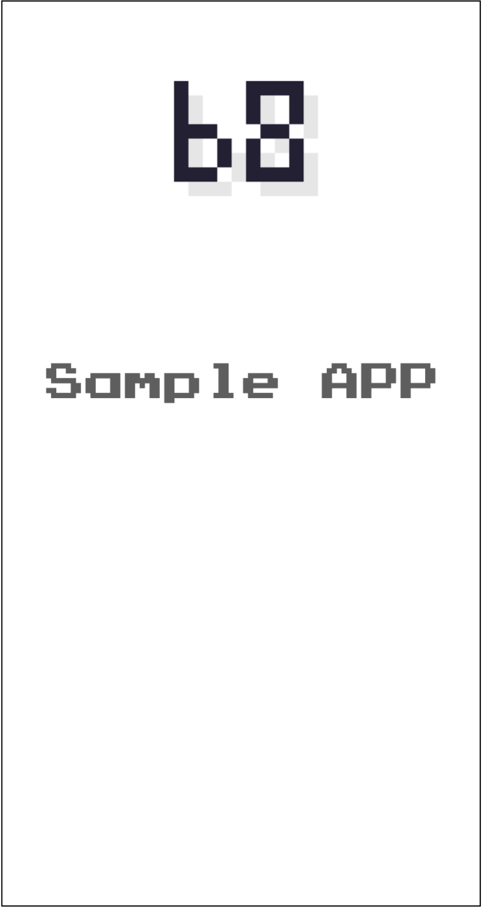
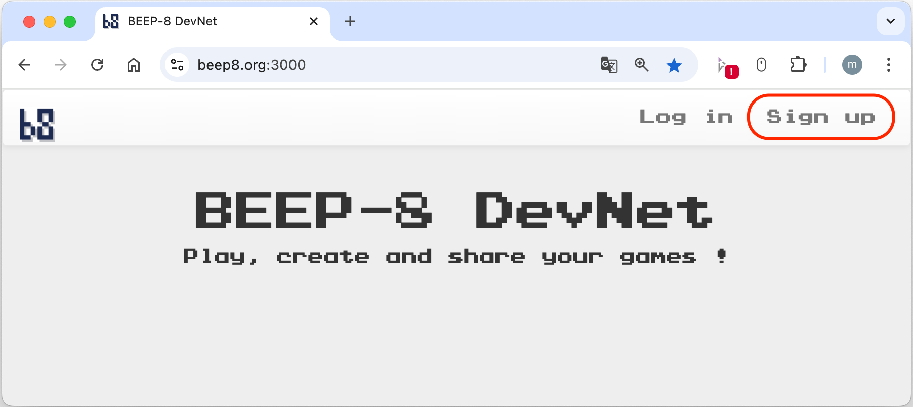
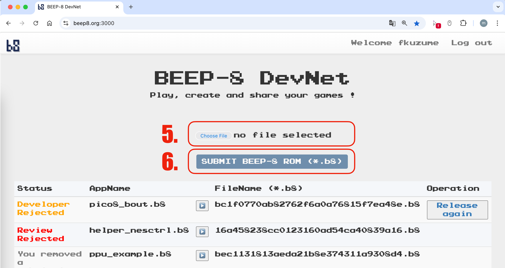
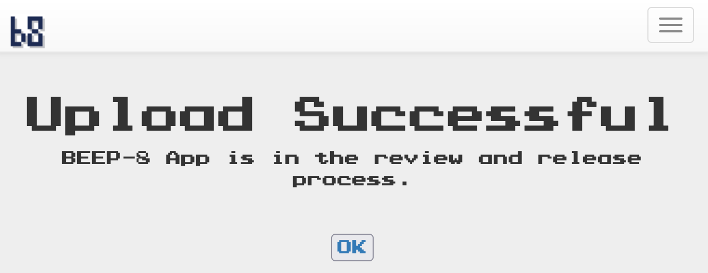
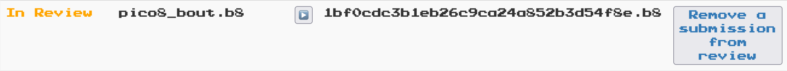

# Releasing a BEEP-8 App

Once you have built your BEEP-8 application, you can publish it on the BEEP-8 portal at https://beep8.org to share with players around the world!

- Each app corresponds to a single `.b8` file.
- After building a sample application, the ROM is generated at `./obj/<app_name>.b8`.
- The file `./romfs/instcard.jpg` is used as the thumbnail displayed on the portal’s homepage.
  - The default `instcard.jpg` is a placeholder. Please replace it with an image appropriate for your app.

  

- Supported thumbnail formats: `.jpg`, `.png`, `.gif`, `.mp4`
    - `.gif` will display as an animation, and `.mp4` will play as a video.

- Thumbnail data is embedded into the `.b8` file when building with `./run.sh`.

- Thumbnail resolution should match smartphone display aspect ratios (e.g. 512×960).  

- For animated thumbnails, using `.mp4` is recommended over `.gif` for better file size and visual quality.  

- If you choose `.mp4`, a frame rate of 60 fps is recommended.

# BEEP-8 DevNet

To release your BEEP-8 app, you need to create a free DevNet account:

1. Visit [https://beep8.org:3000/](https://beep8.org:3000/)  
2. Click **Sign up** in the top-right corner (as shown below):  

  

3. Enter your details and submit to register.  
4. After logging in, go to your dashboard to upload and manage your `.b8` releases.  

  

5. Click **Choose File** and select your `./obj/<app_name>.b8`.  
6. Click **SUBMIT BEEP-8 ROM (*.b8)** to upload your ROM.  

7. Upon successful upload, you will see a confirmation dialog (as shown below).  

  

8. Your submission will appear in the list with its current status (e.g., In Review, Developer Rejected, Released). You can remove or resubmit directly from the dashboard.

  

9. The BEEP-8 team will review your app; once approved, it will be published on beep8.org.  

   The review process includes minimum checks to ensure:  
   - There are no ethical or copyright issues.  
   - The application does not contain any critical defects.  

---

Thank you for releasing your BEEP-8 app! If you have any questions or need support, please email us at [beep8.official@gmail.com](mailto:beep8.official@gmail.com).

*Enjoy sharing your creations with players around the world!*  
