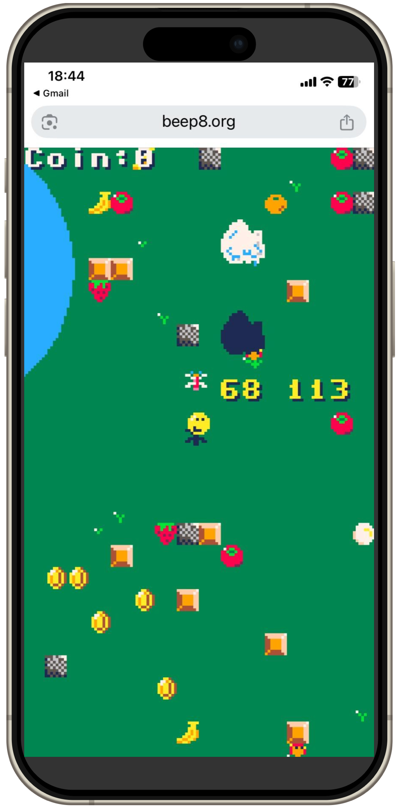

<p align="center">
  
</p>

<p align="center">
  
</p>

# BEEP-8 SDK

[English](./README.md) | [日本語](./README.ja.md) | [繁體中文（廣東話）](./README.zh-hk.md)

**BEEP-8** は C/C++ アプリケーション開発向けに設計された仮想レトロゲームコンソールです。ARM v4 CPU をエミュレートし、固定 4 MHz で動作し、縦型スマートフォンディスプレイに最適化されています。SDK は二層構造を採用しており、低レベルでは最小限の API を通じてハードウェア（H/W）に直接アクセスできます。高レベルでは開発者が自由に構造、フレームワーク、ライブラリを選択してアプリケーションを構築できます。PICO-8 ライクの C/C++ ライブラリも提供されており、迅速で馴染みやすい開発をサポートしますが、使用は完全に任意です。

CPU は 32 ビットプロセッサですが、VDP（ビデオディスプレイプロセッサ）および APU（オーディオプロセッシングユニット）はよりシンプルな 8 ビット時代の仮想デバイスをモデルにしており、モダンなプログラマビリティと懐かしいハードウェア制約のバランスを実現しています。

BEEP-8 はブラウザベースの設計と WebGL／GPU シェーダ最適化により、**PC**、**スマートフォン（iPhone、Android）**、**iPad などのタブレットデバイス**で保証された **60 fps** のスムーズな動作を実現します。

また、iPhone 上でも自作の BEEP-8 アプリを Apple の App Store 審査を経ることなく自由にアップロード・共有できるため、完全に Web ベースのプラットフォームとして動作します。  
全てのアプリは公式ポータル **[https://beep8.org](https://beep8.org)** を通じて即時に共有でき、ファイルをアップロードするだけでグローバル配信が簡単に行えます。

さらに、**8 ビット風タッチ対応ゲーム**を開発でき、レトロ体験とモダンなタッチ操作を組み合わせた、カジュアルかつモバイルフレンドリーなゲームプレイが可能です。

## BEEP-8 システム構成図


- **エミュレートされた CPU:** ARM v4、固定 4 MHz で動作。  
  - 1990 年代中頃に登場したアーキテクチャに基づく。  
  - GNU ARM GCC でコンパイル可能、C++20 に対応。

- **メモリ:** メイン RAM が 1 MB、VRAM が 128 KB（背景レイヤーとスプライトパターンで共有、4 bpp、512×512）。

- **ROM 上限:** ゲームあたり最大 **1024 KB**。

- **PPU (Pixel Processing Unit):** 背景レイヤー、スプライト、図形描画など、すべてのレンダリング操作を担当。  
  - 固定 16 色パレットで 128×240 ピクセル表示を駆動。  
  - 背景とスプライトパターンで 128 KB の VRAM を共有（4 bpp、512×512 レイアウト）。

- **APU (Audio Processing Unit):** Namco C30 風サウンドエンジンをエミュレート。  
  - 8 チャンネルのリアルタイム合成に対応。  
  - レトロ風効果音と音楽再生を提供。

- **HIF (Human Interface):** 専用 HIF モジュールを通じて、キーボード、マウス、**タッチ入力**を完全サポート。  
  - ブラウザの入力イベントをシステムレベルの信号に変換。  
  - PC・モバイルのウェブ環境の両方で最適。

- **TMR (Timer Module):** スケジューリングと割り込みのための高精度タイミングを提供。  
  - 一貫した 60 Hz の周期で定期タスクを駆動。  
  - カスタム RTOS（`b8OS`）と統合してリアルタイム処理を実現。

- **カスタム RTOS (`b8OS`):**  
  - マルチスレッド、セマフォ、割り込みハンドラ、簡易インメモリファイルシステムをサポートする軽量リアルタイム OS。  
  - ゲーム開発向けに最小限の UNIX ライク API を提供。  
  - 通常は OS を意識せずにゲームロジックに集中可能。  
  - メインスレッドとは独立して動作するサウンドドライバなどの非同期コンポーネントを容易に実装。  
  - リアルタイム機能を活かしつつ、複雑な OS レベル実装を回避できるアーキテクチャ。

- **開発環境:**  
  - 上級開発者は仮想ハードウェアコンポーネント（PPU、APU、I/O レジスタ等）を直接制御可能。  
  - 迅速な開発向けに PICO-8 ライクの C/C++ ライブラリも利用可能。  
  - すべての C/C++ ソースコードは完全にオープンで、修正が自由。

- **配布:**  
  - 完成したゲームは単一の ROM ファイルとして配布。  
  - 公式 BEEP-8 ポータルサイト（[https://beep8.org](https://beep8.org)）からゲームを公開可能。  
  - コミュニティが作成したゲームをアップロード、発見、プレイできる共有スペースとして機能。

- **コスト:**  
  - SDK の利用もゲームの公開も完全に無料。

## Quick Start

### 対応プラットフォーム

BEEP-8 SDK はクロスプラットフォーム対応で、以下の環境をサポートしています:

- **Windows** (コマンドプロンプト / PowerShell)
- **macOS（Intel）**
- **macOS（Apple Silicon / M1、M2、M3 など）**
- **Linux**（**Windows WSL2** を含む、Linux 環境として扱われます）

ほとんどのプラットフォームでは外部ツールチェーンのインストールは不要です。SDK には全対応プラットフォーム向けの事前ビルド済みコンパイラが含まれています。

---

### ダウンロード

以下のいずれかの方法で SDK を入手できます:

- **オプション1: リポジトリをクローン（Git ユーザー向け推奨）**  
  ```bash
  git clone https://github.com/beep8/beep8-sdk.git
  ```

- **オプション2: .tar.gz アーカイブとしてダウンロード（Git 不要）**  
  最新の SDK ソースコードを直接 .tar.gz ファイルとしてダウンロード:  
  https://github.com/beep8/beep8-sdk/archive/refs/heads/main.tar.gz

  Git を使いたくないユーザーに最適です。macOS や Linux では標準のツールでアーカイブを展開できます。  
  💡 Windows では 7-Zip を使用して .tar.gz アーカイブを安全に展開することを推奨します。


## ディレクトリ構成

SDK リポジトリの構成は以下の通りです:

```
├── README.md             # このファイル
├── doc/                  # ドキュメント
├── gnuarm/               # 各プラットフォーム向けに事前ビルドされた GNU ARM GCC ツールチェーン
│   ├── Windows_NT/
│   ├── linux/
│   └── osx/
├── sdk/                  # メイン SDK コンポーネント
│   ├── app/              # サンプル BEEP-8 アプリケーションとビルドターゲット
│   ├── b8helper/         # BEEP-8 アプリ開発を支援するオプションのユーティリティライブラリ
│   └── b8lib/            # BEEP-8 SDK のコア実装
├── setenv.bat            # Windows で make を PATH に追加するスクリプト
└── tool/                 # 開発ツール
    ├── busybox/          # Windows で UNIX ライクなコマンドをサポートする BusyBox
    ├── ccache/           # ビルドの再実行を高速化するコンパイラキャッシュ
    ├── genb8rom/         # BEEP-8 ROM ファイルシステムイメージを生成するツール
    ├── geninstcard/      # BEEP-8 ROM 用サムネイル画像を生成するツール
    ├── make/             # Windows 対応の make.exe（setenv.bat でパス設定）
    ├── png2c/            # アセット埋め込み用に PNG を C 配列に変換するオプションツール
    ├── relb8rom/         # リリース用 ROM をパッケージ化するツール（配布に必須）
    └── scripts/          # アプリ開発タスクを自動化するヘルパースクリプト
```

## サンプルアプリのビルド方法

```
sdk/
└─ app/
   ├── hello/          # Hello world サンプル
   ├── pico8_example/  # PICO-8 ライクライブラリ サンプル
   ├── bgprint/        # 背景レイヤーにテキストを表示するサンプル
   ├── helper_nesctrl/ # NES ライクコントローラ サンプル
   ├── ppu_example/    # PPU 直接制御サンプル
   ├── touch/          # タッチパネル状態取得サンプル
   ├── Makefile        # make が好みのユーザー向け Makefile
   ├── build_all.sh    # このディレクトリ以下の全サンプルをビルドするスクリプト
   ├── makefile.app    # make ユーザー向け共通 Makefile インクルード
   ├── run_common.bat  # Windows/DOS プロンプト用ビルドバッチ
   └── run_common.sh   # macOS/Linux 用ビルドシェルスクリプト
```

各サンプルは単一のスクリプトでビルド、ROM 生成、起動が行えます。`make` は必要に応じてご使用ください。  
たとえば `pico8_example` サンプルをビルドするには:

```bash
cd sdk/app/pico8_example
./run.sh
```

このコマンドはソースコードとグラフィックデータをコンパイルし、`.b8` ROM を生成し、そのままデフォルトの Web ブラウザで起動します。

<p align="center">
  
</p>

`./run.sh` が正常終了すると、以下のようなブラウザウィンドウが表示されます:  
- 左側にエンドユーザー向けのゲーム画面、右側にデバッグコンソール（仮想ターミナル）が表示されます。`printf()` の出力はここに表示されます。  
- 毎回 `./run.sh` と入力するのが面倒な場合は、シェル設定にエイリアスを追加できます:
  ```bash
  alias r='./run.sh'
  ```
- 各実行には固有の URL が割り当てられます。この URL をスマートフォンなどのブラウザにコピー＆ペーストして、リモートで同じアプリを実行できます。

<p align="center">
  
</p>

上級者（Make/CI）向けの詳細な Make ベースの手順は [MAKEFILE.md](MAKEFILE.md) を参照してください。

## API ドキュメント

詳細な API 情報については、`sdk/b8lib/include/` ディレクトリ内のヘッダーファイルを参照してください。主なヘッダーは以下のとおりです:
- **その他のヘッダー:** PPU、APU、RTOS（`b8OS`）の低レベルインターフェースを提供。

[API Reference BEEP-8 SDK](https://beep8.github.io/beep8-sdk/api/BEEP8_SDK/html/files.html)  
BEEP-8 SDK は BEEP-8 アプリ開発に必要な **コアシステムライブラリ** です。  
CPU、PPU、APU、タイマー、RTOS（`b8OS`）などの仮想ハードウェアへ直接アクセスできる機能を提供します。  
ベアメタルスタイル開発に必要なすべての基本関数がここに定義されています。

[API Reference BEEP-8 HELPER LIB](https://beep8.github.io/beep8-sdk/api/BEEP8_HELPER/html/files.html)  
BEEP-8 HELPER はアプリ開発を加速する **オプションのユーティリティライブラリ** です。  
グラフィクスヘルパー、数学関数、簡易入力マネージャーなど、ハードウェアレベルの複雑性を抽象化するモジュールを含んでいます。

[API Reference PICO-8 LIKE LIB](https://beep8.github.io/beep8-sdk/api/BEEP8_HELPER/html/pico8_8h.html)  
このライブラリは C/C++ で書かれた **PICO-8 スタイル互換ライブラリ** です。  
オリジナルの PICO-8 API を可能な限り忠実に再現しつつ、C/C++ の文法に適応させています。  
PICO-8 ユーザーにとって馴染みのある開発体験を提供しつつ、ネイティブコードの性能と柔軟性を活かせることが目的です。  
基礎的なハードウェア知識がなくても、このライブラリを使って完全なゲームを構築できます。

## BEEP-8アプリのリリース方法

- ゲームを [beep8.org](https://beep8.org) で世界中のプレイヤーと共有しましょう！  
- BEEP-8アプリをリリースするには、以下を参照してください:

[RELEASE.ja.md](RELEASE.ja.md)

## ライセンス

このプロジェクトは MIT ライセンスの下で公開されています。詳細は LICENSE ファイルを参照してください。

## お問い合わせ

- **メール:** beep8.official@gmail.com
- **ウェブサイト:** https://beep8.org

*BEEP-8 でのコーディングをお楽しみください！*
