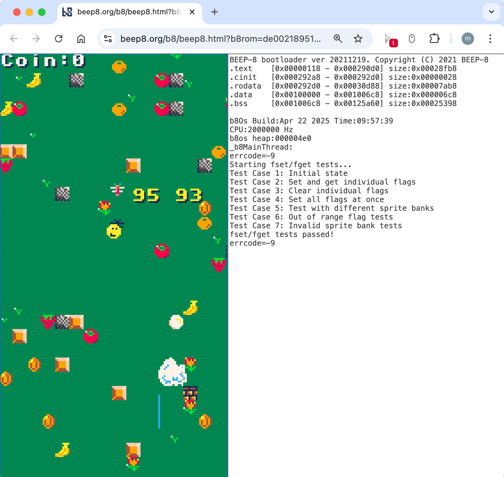

<p align="center">
  
</p>

<p align="center">
  
</p>

# BEEP-8 SDK

[English](./index.md) | [日本語](./index.ja.md) | [繁體中文（廣東話）](./index.zh-hk.md)

**BEEP-8** is a virtual retro game console designed for developing C/C++ applications. It runs on an emulated ARM v4 CPU at a fixed 4 MHz and is optimized for vertical smartphone displays. The SDK adopts a two-layer architecture: at the low level, developers can directly access hardware (H/W) through minimal APIs. At the high level, developers are free to choose their own structure, frameworks, or libraries to build applications. A PICO‑8–like C/C++ library is provided as one such option for rapid and familiar development, but it is entirely optional.

While the CPU is a 32-bit processor, the VDP (video display processor) and APU (audio processing unit) are modeled after simpler 8-bit–era virtual devices, striking a balance between modern programmability and nostalgic hardware constraints.

BEEP-8 runs smoothly at a guaranteed **60 fps** on **PC**, **smartphones (iPhone, Android)**, and **tablet devices such as iPad**, thanks to its browser-based design and rendering optimizations using **WebGL and GPU shaders**.

Even on iPhones, you can freely upload and share your self-made BEEP-8 apps with users around the world **without going through Apple’s App Store review process**, since the platform is entirely web-based.  
All apps can be shared instantly via the official portal at **[https://beep8.org](https://beep8.org)**, making global distribution as simple as uploading a file.

It also allows developers to create **8-bit-style touch-enabled games**, offering a retro experience combined with modern touch interaction—ideal for casual and mobile-friendly gameplay.

## BEEP-8 System Block Diagram


- **Emulated CPU:** ARM v4 running at a fixed 4 MHz.  
  - Based on an architecture originating in the mid-1990s.  
  - Compilable using GNU ARM GCC and supports C++20.

- **Memory:** Main RAM is 1 MB and VRAM is 128 KB (shared for BG and sprite patterns, 4 bpp, 512×512).

- **ROM Limit:** Maximum size is **1024 KB** per game.

- **PPU (Pixel Processing Unit):** Handles all rendering operations including background layers, sprites, and shape drawing.  
– Drives the 128×240 pixel display using a fixed 16-color palette.  
– Shares access to 128 KB of VRAM with both BG and sprite patterns (4 bpp, 512×512 layout).

- **APU (Audio Processing Unit):** Emulates a Namco C30-style sound engine.  
– Supports 8 audio channels with real-time synthesis.  
– Provides retro-style sound effects and music playback.

- **HIF (Human Interface):** Fully supports keyboard, mouse, and **touch inputs** via a dedicated HIF module.
– Converts browser input events into system-level signals.  
– Ideal for both PC and mobile web environments.

- **TMR (Timer Module):** Provides high-precision system timing for scheduling and interrupts.  
– Drives periodic system tasks at a consistent 60 Hz tick rate.  
– Integrated with the custom RTOS (`b8OS`) for real-time operations.

- **Custom RTOS (`b8OS`):**  
  - A lightweight real-time operating system that supports multi-threading, semaphores, interrupt handlers, and a simple in-memory file system.  
  - Designed to provide a minimal set of UNIX-like APIs tailored for game development.  
  - In most cases, developers can ignore the presence of the OS entirely and focus purely on game logic.  
  - Enables asynchronous components, such as sound drivers operating independently from the main thread, to be implemented with ease.  
  - Its architecture allows developers to avoid complex OS-level implementation details while benefiting from real-time capabilities.

- **Development Environment:**  
  - Advanced developers can directly control virtual hardware components (e.g., PPU, APU, I/O registers).  
  - Alternatively, a PICO-8-like C/C++ library is available for rapid development.  
  - All C/C++ source code is fully open and available for modification.

- **Distribution:**  
  - Completed games are delivered as a single ROM file.  
  - Developers can release their games on the official BEEP‑8 portal site: [https://beep8.org](https://beep8.org)  
  - The portal serves as a shared space where everyone can upload, discover, and play games created by the community.

- **Cost:**  
  - The SDK is completely free to use, and game releases are free as well.

---

## Quick Start

### Supported Platforms

The BEEP-8 SDK is cross-platform and supports the following environments:

- **Windows** (Command Prompt / PowerShell)  
  - Provides two options: native Command Prompt and WSL2 (Windows Subsystem for Linux 2)  
  - While Command Prompt is supported, development in WSL2 is strongly recommended
- **macOS (Intel)**  
- **macOS (Apple Silicon / M1, M2, M3, etc.)**  
- **Linux** (including WSL2 on Windows, which is treated as a Linux environment)  

On most platforms, no external toolchain installation is required—the SDK includes prebuilt compilers for all supported platforms.

---

### Download

You can get started with the SDK in one of the following ways:

- **✅ Option 1: Clone the Repository (Recommended)**  
  This is the most reliable and up-to-date method. If you are comfortable using Git, we strongly recommend cloning the repository:

  ```bash
  git clone https://github.com/beep8/beep8-sdk.git
  ```

  This ensures you always get the latest version, and avoids security flags like Gatekeeper quarantine on macOS.

- **⚠️ Option 2: Download as a .tar.gz Archive (Alternative method)**  
  This method is provided for users who prefer not to use Git. You can download the latest snapshot of the source code here:  
  https://github.com/beep8/beep8-sdk/archive/refs/heads/main.tar.gz

  On macOS and Linux, the archive can be extracted with built-in tools.  
  💡 **Important for macOS users**: Files downloaded via a web browser may be quarantined by Gatekeeper, causing apps to be blocked.  
  To resolve this, after extracting the archive, run the following command in Terminal:

  ```bash
  xattr -r -d com.apple.quarantine <extracted-folder>
  ```

  💡 On Windows, we recommend using [7-Zip](https://www.7-zip.org/) to extract `.tar.gz` archives properly.

---

We strongly recommend using **Option 1** (Git) unless you have a specific reason to avoid Git.

---

### Directory Structure

The SDK repository is organized as follows:

```
├── README.md             # This file
├── doc/                  # Documentation
├── gnuarm/               # Prebuilt GNU ARM GCC toolchains for each supported platform
│   ├── Windows_NT/
│   ├── linux/
│   └── osx/
├── sdk/                  # Main SDK components
│   ├── app/              # Sample BEEP-8 applications and build targets
│   ├── b8helper/         # Optional utility libraries to assist BEEP-8 app development
│   └── b8lib/            # Core BEEP-8 SDK implementation
├── setenv.bat            # Windows script to add make to the system PATH
└── tool/                 # Development tools
    ├── busybox/          # BusyBox for UNIX-like command support on Windows
    ├── ccache/           # Compiler cache to speed up rebuilds
    ├── genb8rom/         # Tool for generating BEEP-8 ROM filesystem images
    ├── geninstcard/      # Tool for generating thumbnail images for BEEP-8 ROMs
    ├── make/             # Windows-compatible make.exe, path set via setenv.bat
    ├── png2c/            # Optional PNG-to-C array converter for asset embedding
    ├── relb8rom/         # Tool for packaging final release ROMs (required for distribution)
    └── scripts/          # Helper scripts for automating app development tasks
```

---

### Build a Sample Application

```
sdk/                   # Main SDK components
└─ app/                # Sample BEEP-8 applications and build targets
   ├── hello/          # Hello world sample in BEEP-8
   ├── pico8_example/  # PICO-8–style library sample
   ├── bgprint/        # Prints text to the background layer
   ├── helper_nesctrl/ # NES-like controller sample displayed on-screen
   ├── ppu_example/    # Direct PPU control sample
   ├── touch/          # Touch panel status retrieval sample
   ├── Makefile        # Makefile for users who prefer make
   ├── build_all.sh    # Script to build all samples under this directory
   ├── makefile.app    # Shared Makefile include for make users
   ├── run_common.sh   # Build shell script for macOS/Linux users
   └── run_common.bat  # Build BAT for Windows/DOS prompt users
```

Each sample can be built, ROM-generated, and launched with a single script. No `make` is required unless you prefer it.

---

#### macOS / Linux (Bash)

1. Change into your sample’s directory (example: `pico8_example`):
   ```bash
   cd sdk/app/pico8_example
   ```
2. Run the build-and-launch script:
   ```bash
   ./run.sh
   ```
   This will:
   - Compile all source files and graphics data  
   - Generate the `.b8` ROM file  
   - Open the application in your default web browser  

<p align="center">
  
</p>

- **Left pane:** the running game  
- **Right pane:** hidden debug console (your `printf()` output appears here)  
- If typing `./run.sh` each time is tedious, add an alias in your shell config:
  ```bash
  alias r='./run.sh'
  ```
- Each run gets a unique URL—you can paste it into any device’s browser to play remotely.  

---

#### Windows (Command Prompt)

1. Open **Command Prompt**, then change into your sample’s directory:
   ```cmd
   cd sdk\app\pico8_example
   ```
2. Run the build-and-launch script:
   ```cmd
   run.bat
   ```
   This will:
   - Compile all source files and graphics data  
   - Generate the `.b8` ROM file  
   - Launch the application in your default web browser  

- **Left pane:** the running game  
- **Right pane:** hidden debug console (your `printf()` output appears here)  
- To shortcut `run.bat`, define a DOS key macro:
  ```cmd
  doskey r=run.bat $*
  ```
- Each run gets a unique URL—you can paste it into any device’s browser to play remotely.  

---

**Advanced users (Make/CI):** see [MAKEFILE.md](MAKEFILE.md) for full Make-based instructions.


---

#### Sample Application Directory Structure

```
pico8_example
├── run.sh                     # Build and upload script
├── data
│   ├── export
│   │   ├── sprite0.png.cpp   # Converted from sprite0.png to C++ source
│   │   └── sprite1.png.cpp   # Converted from sprite1.png to C++ source
│   └── import
│       ├── sprite0.png       # 128×128 sprite (4bpp), Bank #0
│       └── sprite1.png       # 128×128 sprite (4bpp), Bank #1
├── main.cpp                   # Application source code
└── romfs
    └── instcard.jpg           # Title image for distribution
```

- Files in `data/import/` (e.g. `sprite0.png`) are automatically converted by `png2c` into C++ source files under `data/export/` (e.g. `sprite0.png.cpp`), each containing the image data as a C-style array for inclusion in the ROM.
- `./run.sh clean` removes `obj/` and `data/export/` to restore the project to a clean state.
- The `romfs/instcard.jpg` file serves as the title image in the distributed ROM.
- Unlike PICO‑8, **BEEP‑8 does not include built-in image editors**; use your preferred graphics tool with the BEEP‑8 palette.

---

## API Documentation

For complete API details, please refer to the header files in the `sdk/b8lib/include/` directory. Key headers include:
- **Other headers:** Provide low-level interfaces for the PPU, APU, and RTOS (`b8OS`).

[API Reference BEEP-8 SDK](https://beep8.github.io/beep8-sdk/api/BEEP8_SDK/html/files.html)  
BEEP-8 SDK is the **core system library** required for developing BEEP-8 applications.  
It provides direct access to the virtual hardware such as CPU, PPU, APU, timers, and the RTOS (`b8OS`).  
All essential functions for bare-metal style development are defined here.

[API Reference BEEP-8 HELPER LIB](https://beep8.github.io/beep8-sdk/api/BEEP8_HELPER/html/files.html)  
BEEP-8 HELPER is an **optional utility library** that provides helpful modules to accelerate application development.  
It includes utilities such as graphics helpers, math functions, and simple input managers that abstract away some of the hardware-level complexity.

[API Reference PICO-8 LIKE LIB](https://beep8.github.io/beep8-sdk/api/BEEP8_HELPER/html/pico8_8h.html)  
This is a **PICO-8–style compatibility library** written in C/C++.  
It mimics the original PICO-8 API as closely as possible while adapting it to C/C++ semantics.  
The goal is to make the development experience familiar for PICO-8 users, while still leveraging the performance and flexibility of native code.  
You can build full games using this library with minimal knowledge of the underlying hardware.

---

## How to Release a BEEP-8 App

- Share your game with players around the world on [beep8.org](https://beep8.org)!  
- To release your BEEP-8 app, see the instructions below:

[RELEASE.md](RELEASE.md)

---

## License

This project is licensed under the MIT License. See the LICENSE file for details.

---

## Contact

- **Email:** [beep8.official@gmail.com](mailto:beep8.official@gmail.com)
- **Website:** [https://beep8.org](https://beep8.org)

---

*Happy coding with BEEP-8!*
