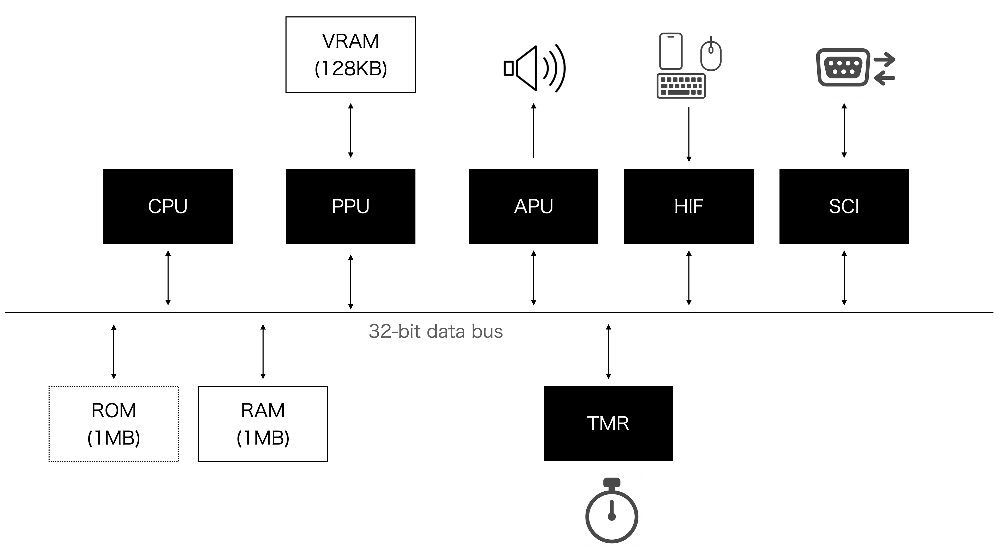
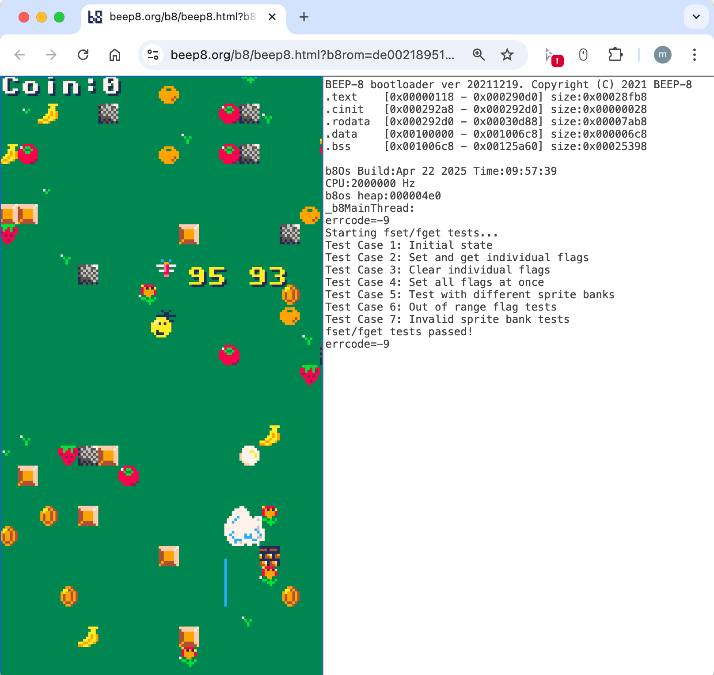
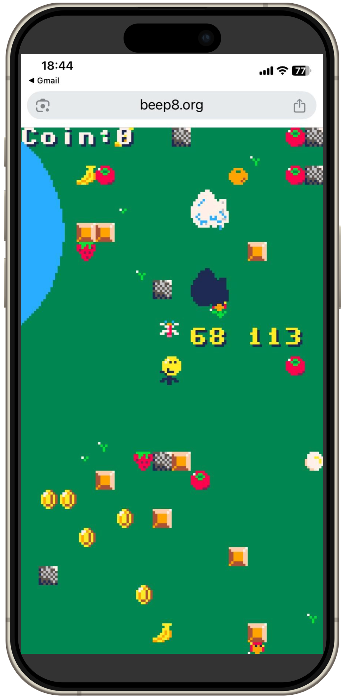

<p align="center">
  
</p>

<p align="center">
  
</p>

# BEEP-8 SDK

[English](./index.md) | [日本語](./index.ja.md) | [繁體中文（廣東話）](./index.zh-hk.md)

**BEEP-8** 係一部為 C/C++ 應用程式開發而設嘅虛擬復古遊戲機。佢以模擬 ARM v4 CPU 運行，時脈固定 4 MHz，同時針對垂直智能手機屏幕作咗優化。SDK 採用雙層架構：喺低層，開發人員可以透過最低限度嘅 API 直接存取硬體（H/W）；喺高層，開發人員可以自由揀選自己嘅結構、框架或者函式庫去構建應用程式。亦提供咗一個類似 PICO‑8 嘅 C/C++ 函式庫，方便快速又熟悉嘅開發，但呢個全層面都係可選擇嘅。

雖然 CPU 係 32 位元處理器，但 VDP（視訊顯示處理器）同 APU（音訊處理單元）則模仿較簡單嘅 8 位元時代虛擬裝置，喺現代可程式化同懷舊硬體限制之間搵到平衡。

因為採用網頁為基礎嘅設計，同埋用 WebGL 同 GPU 睇色器作渲染優化，BEEP-8 可以喺 **PC**、**智能手機（iPhone、Android）** 同 **iPad 等平板裝置** 上，穩定保證 **60 fps** 流暢運行。

就算喺 iPhone 上，都可以完全免經 Apple App Store 審批，隨時上載同分享你自己整嘅 BEEP-8 應用畀全世界用家，因為整個平台都係網頁化。  
所有應用都可以經官方門戶 **[https://beep8.org](https://beep8.org)** 即時分享，全球發佈只要上載檔案就夠簡單。

佢亦都容許開發人員創作 **8 位元風格嘅觸控遊戲**，結合懷舊操作體驗同現代觸控互動，啱曬休閒同手機友好型遊戲玩法。

## BEEP-8 系統方塊圖



- **模擬 CPU:** ARM v4，固定 4 MHz 運行。  
  - 基於 1990 年代中期出現嘅架構。  
  - 支援 GNU ARM GCC 編譯，兼容 C++20。

- **記憶體:** 主 RAM 1 MB，同 VRAM 128 KB（背景層同精靈圖樣共用，4 bpp，512×512）。

- **ROM 限制:** 每款遊戲最大可用 **1024 KB**。

- **PPU（像素處理單元）:** 處理所有渲染操作，包括背景層、精靈圖同圖形繪製。  
  - 喺固定 16 色調色盤下驅動 128×240 像素顯示。  
  - 背景層同精靈圖樣共享 128 KB VRAM（4 bpp，512×512 佈局）。

- **APU（音訊處理單元）:** 模擬 Namco C30 風格嘅音效引擎。  
  - 支援 8 條音軌實時合成。  
  - 提供懷舊風格嘅音效同音樂播放。

- **HIF（人機介面）:** 透過專用 HIF 模組完全支援鍵盤、滑鼠同 **觸控輸入**。  
  - 將瀏覽器嘅輸入事件轉換成系統層級信號。  
  - 適合 PC 同移動網頁環境。

- **TMR（計時模組）:** 提供高精度嘅系統定時，用嚟排程同中斷。  
  - 以穩定嘅 60 Hz 週期驅動週期性系統任務。  
  - 同自定義 RTOS（`b8OS`）整合實現實時操作。

- **自定義 RTOS（`b8OS`）:**  
  - 一個輕量級實時作業系統，支援多線程、信號量、中斷處理程序同簡易內存檔案系統。  
  - 提供最小化嘅 UNIX 風格 API，專為遊戲開發而設。  
  - 大部分情況下，開發者可以唔洗理會 OS，專注喺遊戲邏輯上。  
  - 容易實現異步組件，例如同主執行緒獨立運行嘅音效驅動。  
  - 架構設計令開發者唔使處理複雜嘅 OS 級別實現，依然享受實時功能。

- **開發環境:**  
  - 進階開發者可以直接控制虛擬硬件組件（例如 PPU、APU、I/O 暫存器）。  
  - 或者使用 PICO-8 風格嘅 C/C++ 函式庫快速開發。  
  - 所有 C/C++ 原始碼完全開放，歡迎修改。

- **發佈:**  
  - 完成嘅遊戲會打包成單一 ROM 檔案。  
  - 開發者可以喺官方 BEEP-8 門戶網站 [https://beep8.org](https://beep8.org) 發佈佢哋嘅遊戲。  
  - 該門戶係一個共享平台，大家可以上載、發掘同玩社群製作嘅遊戲。

- **成本:**  
  - SDK 同遊戲發佈全程免費。

## 快速開始

### 支援平台

BEEP-8 SDK 支援以下跨平台環境：

- **Windows**（命令提示字元 / PowerShell）  
- **macOS（Intel）**  
- **macOS（Apple Silicon / M1、M2、M3 等）**  
- **Linux**（包括 **Windows WSL2**，視為 Linux 環境）

大多數平台無需額外安裝工具鏈——SDK 已包含所有支援平台的預建編譯器。

---

### 下載

您可以透過下列方式取得 SDK：

- **選項1：克隆倉庫（推薦給 Git 使用者）**  
  ```bash
  git clone https://github.com/beep8/beep8-sdk.git
  ```

- **選項2：以 .tar.gz 壓縮檔下載（無需 Git）**  
  直接下載最新 SDK 原始碼的 .tar.gz 檔案：  
  https://github.com/beep8/beep8-sdk/archive/refs/heads/main.tar.gz  

  若不想使用 Git，這種方式最為方便。在 macOS 或 Linux 上可使用系統內建工具解壓。  
  💡 在 Windows 上建議使用 7-Zip 安全地解壓 .tar.gz 檔案。  

## 目錄結構

SDK 倉庫嘅目錄結構如下:

```
├── README.md             # 呢個文件
├── doc/                  # 文件
├── gnuarm/               # 各平台預建嘅 GNU ARM GCC 工具鏈
│   ├── Windows_NT/
│   ├── linux/
│   └── osx/
├── sdk/                  # 主要 SDK 組件
│   ├── app/              # BEEP-8 範例應用同構建目標
│   ├── b8helper/         # 可選嘅幫助 BEEP-8 應用開發嘅工具庫
│   └── b8lib/            # BEEP-8 SDK 核心實現
├── setenv.bat            # Windows 下用嚟將 make 加入 PATH 嘅腳本
└── tool/                 # 開發工具
    ├── busybox/          # 喺 Windows 上提供 UNIX 式命令支持嘅 BusyBox
    ├── ccache/           # 用於加速重構建嘅編譯器緩存
    ├── genb8rom/         # 用嚟生成 BEEP-8 ROM 文件系統映像嘅工具
    ├── geninstcard/      # 用嚟生成 BEEP-8 ROM 縮略圖嘅工具
    ├── make/             # Windows 兼容嘅 make.exe，由 setenv.bat 設置路徑
    ├── png2c/            # 可選嘅 PNG 轉 C 數組工具，用於嵌入資產
    ├── relb8rom/         # 用於打包最終發布 ROM 嘅工具（發布必需）
    └── scripts/          # 自動化應用開發任務嘅輔助腳本
```

## 構建範例應用

```
sdk/
└─ app/
   ├── hello/          # Hello world 範例
   ├── pico8_example/  # PICO-8 風格函式庫範例
   ├── bgprint/        # 在背景圖層顯示文字的範例
   ├── helper_nesctrl/ # 類 NES 控制器範例
   ├── ppu_example/    # 直接操作 PPU 的範例
   ├── touch/          # 觸控面板狀態取得範例
   ├── Makefile        # 偏好使用 make 的使用者專用 Makefile
   ├── build_all.sh    # 用於構建此目錄下所有範例的腳本
   ├── makefile.app    # 供 make 使用者共用的 Makefile 引入
   ├── run_common.bat  # Windows/DOS 提示字元下的構建批次檔
   └── run_common.sh   # macOS/Linux 上的構建 Shell 腳本
```

每個範例都可以透過單一腳本構建、生成 ROM，並直接啟動。是否需要使用 `make` 取決於您的喜好。  
例如，要構建 `pico8_example` 範例，請執行:

```bash
cd sdk/app/pico8_example
./run.sh
```

此命令會編譯所有原始碼與圖形資源，生成 `.b8` ROM，並在預設的 Web 瀏覽器中自動啟動。

<p align="center">
  
</p>

當 `./run.sh` 成功執行後，您會看到如下的瀏覽器視窗:  
- 左側顯示給最終使用者的遊戲畫面，右側為除錯控制台（虛擬終端），`printf()` 的輸出將顯示於此。  
- 如果每次輸入 `./run.sh` 覺得麻煩，可在 Shell 配置檔新增別名:
  ```bash
  alias r='./run.sh'
  ```
- 每次執行會獲得一條唯一的 URL，您可以將該 URL 複製到手機瀏覽器中，遠程運行相同的應用。

<p align="center">
  
</p>

進階使用者（Make/CI）：請參考 [MAKEFILE.md](MAKEFILE.md) 獲取完整的 Make 指令說明。

## API 文件

欲獲取完整 API 詳細資訊，請參閱 `sdk/b8lib/include/` 目錄下的標頭檔。主要標頭包括：
- **其他標頭檔：** 提供 PPU、APU 及 RTOS（`b8OS`）的低階介面。

[API 參考 BEEP-8 SDK](https://beep8.github.io/beep8-sdk/api/BEEP8_SDK/html/files.html)  
BEEP-8 SDK 是開發 BEEP-8 應用所需的核心系統庫。  
它提供直接存取虛擬硬件，例如 CPU、PPU、APU、定時器以及 RTOS（`b8OS`）的功能。  
所有進行裸機式開發所需的基本函式都在此定義。

[API 參考 BEEP-8 HELPER LIB](https://beep8.github.io/beep8-sdk/api/BEEP8_HELPER/html/files.html)  
BEEP-8 HELPER 是一個可選的工具庫，提供加速應用開發的輔助模組。  
它包括圖形輔助、數學函式和簡易輸入管理等，能抽象化部分硬件層面的複雜性。

[API 參考 PICO-8 LIKE LIB](https://beep8.github.io/beep8-sdk/api/BEEP8_HELPER/html/pico8_8h.html)  
這是一個以 C/C++ 編寫的 PICO-8 風格兼容庫。  
它盡可能忠實地模擬原始 PICO-8 API，同時適應 C/C++ 語義。  
其目標是為 PICO-8 用戶提供熟悉的開發體驗，同時利用原生代碼的效能和靈活性。  
您只需具備對底層硬件的最基本認識，即可使用此庫構建完整遊戲。

## 點樣發佈 BEEP-8 應用

- 喺 [beep8.org](https://beep8.org) 與全世界玩家分享你嘅遊戲！  
- 想發佈你嘅 BEEP-8 應用，請參閱以下說明:

[RELEASE.zh-hk.md](RELEASE.zh-hk.md)

## 許可證

本項目以 MIT 許可證發布。詳情請參閱 LICENSE 文件。

## 聯絡方式

- **電郵：** beep8.official@gmail.com
- **網站：** https://beep8.org
- **Bluesky:** [@beep8-official.bsky.social](https://bsky.app/profile/beep8-official.bsky.social)

*祝您愉快地使用 BEEP-8 編程！*
